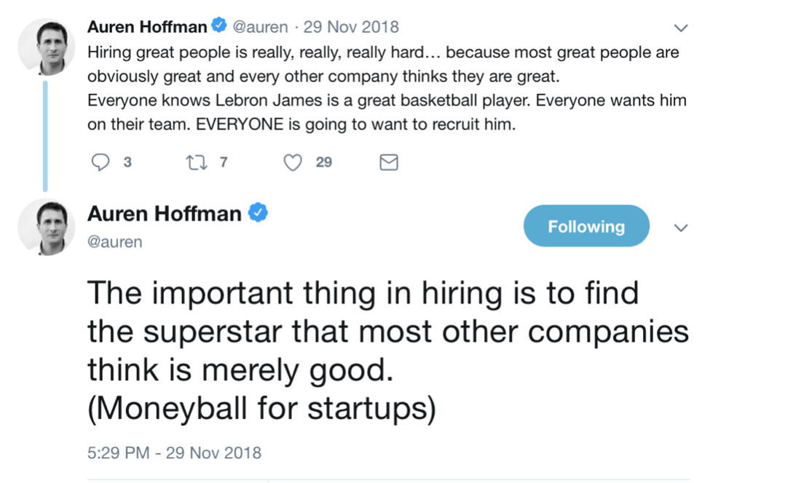

# Those who get extra points (づ￣ ³￣)づ
## The craftsperson （＾∀＾）
- Does the person invest in their own skills? 
- Do they read up on sales/coding/whatever? 
- Do they live and breath the latest research/developments in their industry?  
- Do their eyes light up when talking about what's happening in the industry? 

## High emotional IQ (๑╹ڡ╹) ♡
( •_•)   		Adults that can manage the ups & downs of their emotions
( •_•)>⌐■-■  	Empathetic to other humans
(⌐■_■)    		Get internal joy from the doing vs motivated by flossing/having power over/validation from other people 

Does this person say ‘we vs I delivered the sale/project’. Do they think about how to collaborate? Do they seem to answer questions in ways that demonstrate walking in other’s shoes?  Do they listen intently and ask you questions based on your last answer, dig into what isn’t clear vs reeling out a set of pre canned questions?  Do they ask you situational questions about your own goals as a manager/colleague and think through how they can help? 

High EQ people have judgement and ask a lot of questions around priorities get to grips with what is implicitly and explicitly important before getting to the doing. If you have people that have good judgement, you can have less rules as a company!

## The underestimated (✾♛‿♛)
John Kennedy (Senior), an investor and businessman, when he wanted to know what was actually happening would call the second/third in command not the VPs.  e.g. the official or unofficial second in command at medium to big corp are usually the people that are doing the work.  Most VPs are busy staring at dashboards or sitting in meetings 90% of time.

The underestimated are also often women, people with accents/immigrants or those that don’t feel comfortable taking inflated credit for the team’s work.Try to find the people that have kids/are carers and don’t have time to go around networking to raise their personal visibility. 

Hire those people, give them the titles they deserve and watch magic happen

